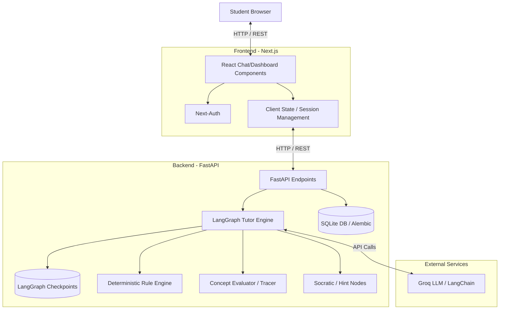

# Scaffold AI

Scaffold AI is an advanced, AI-driven educational platform designed to act as a personalized Socratic tutor. By leveraging state-of-the-art language models and graph-based execution pipelines, it provides **instructional scaffolding**—guiding students to understand complex concepts and solve problems on their own without simply spoon-feeding them the answers.

## Key Features

- **Concept Graph Generation:** Dynamically breaks down topics into micro-graphs of fundamental concepts and prerequisites.
- **Knowledge Tracing Engine:** Evaluates student responses to update their mastery states (Known, Partial, Unknown, Misconception) in real-time.
- **Socratic Diagnostician:** Identifies exactly where a student is stuck and asks targeted questions to prompt critical thinking.
- **Rule Engine:** Deterministically catches common mistakes (like sign errors in math) to provide immediate, context-aware intervention.
- **Student Profiling:** Adapts pacing, strictness, and hints based on the student's historical performance and weak topics.

## Architecture Overview

The system is built on a modern, decoupled architecture, utilizing a robust frontend for student interactions and a highly concurrent backend for executing AI workloads, tracing knowledge, and managing state.



## Technology Stack

### Frontend
- **Framework:** Next.js (React)
- **Styling:** Tailwind CSS, Radix UI Primitives, Framer Motion
- **Authentication:** Next-Auth
- **Data Visualization:** Recharts
- **Icons:** Lucide React
- **Language:** TypeScript

### Backend
- **Framework:** FastAPI
- **AI / LLM Orchestration:** LangGraph, LangChain, Groq (Llama 3.1)
- **Database:** SQLite (with AsyncIO support via aiosqlite)
- **ORM & Migrations:** SQLAlchemy, Alembic
- **State Management:** LangGraph Checkpoints
- **Language:** Python 3.10+

## Getting Started

### Prerequisites
- Node.js (v18 or higher recommended)
- Python (3.10 or higher recommended)

### Backend Setup

1. Navigate to the backend directory:
   ```bash
   cd backend
   ```
2. Create and activate a virtual environment:
   ```bash
   python -m venv venv
   # On macOS/Linux:
   source venv/bin/activate
   # On Windows:
   venv\Scripts\activate
   ```
3. Install dependencies:
   ```bash
   pip install -r requirements.txt
   ```
4. Configure environment variables. Create a `.env` file in the `backend` directory (ensure `GROQ_API_KEY` is set).
5. Run database migrations:
   ```bash
   alembic upgrade head
   ```
6. Start the FastAPI development server:
   ```bash
   uvicorn app.main:app --reload
   ```

### Frontend Setup

1. Navigate to the frontend directory:
   ```bash
   cd frontend
   ```
2. Install dependencies:
   ```bash
   npm install
   ```
3. Configure environment variables. Create a `.env.local` file in the `frontend` directory.
4. Start the Next.js development server:
   ```bash
   npm run dev
   ```

## License

See the [LICENSE](LICENSE) file for more information.
